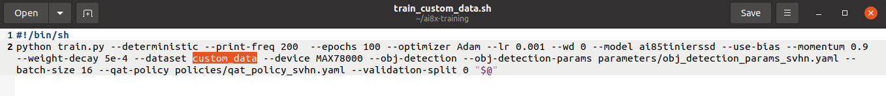

# MAX78000-Custom-dataset
If you have own dataset you can label by [roboflow](https://app.roboflow.com/), but if you don't have own datasets? find and dowload [universe.roboflow](https://universe.roboflow.com/search?q=object%20detection&t=metadata)

You can labeling images by roboflow and export dataset YOLO v4 PyTorch. 


After exporting, place that file in your directory.


In this example we use [bottle_dataset.zip](https://github.com/WeerawatW/MAX78000-Custom-dataset/releases/download/Dataset/custom_data.zip)

Create new folder, i'll rename this folder is `custom_data`


Open  .zip file from roboflow, move `test` and `train` folder from into `custom_data` . 


than delete these file `test` and `train`, rename `test_rename` folder -> `test` and `train_rename` folder -> `train` folder.


Inside  `test` folder.


In `_class.txt` .


In `_annotation.txt` .


### A step) You can use [custom_dataset_convert_format.py](https://github.com/WeerawatW/MAX78000-Custom-dataset/blob/bc48ff8dee874af55faf5815098fa650d1d3fd03/file_for_github/your_directory/custom_dataset_convert_format.py)

 This script use for 1)convert .txt  to .csv format(shiping label) 2)rename images files. 

 
Note: Change ***mode*** to `test`and change ***path*** to extracted directory, `custom_dataset_convert_format.py` file can convert limit only 2 object in 1 image, if you want to add object more than 2 you can modify `custom_dataset_convert_format.py` code.


Then , Run `custom_dataset_convert_format.py` .


After run `custom_dataset_convert_format.py` that program generate `test_rename` folder and `test_label/test_info.csv` file.

Result


test_rename (images).


train_info.csv(annotations).


than delete these file `test` and `train`.


rename `test_rename` folder -> `test` and `train_rename` folder -> `train` folder.


Create `processed` folder


Move `train_info.csv` and `test_info.csv` to `processed` folder .


### Congratulation!! , now you have  `processed`, `test`, `train` folder.

## 1) ai8x-training
Process datasets 
We use [datasets.zip](https://github.com/WeerawatW/MAX78000-Custom-dataset/releases/download/Dataset/custom_data.zip) you can download it, or you have your own dataset **move** `processed`, `test`, `train` folder into `your data` folder, in this exmaple `your data` is `custom_data` folder.

After the download is complete or you have  `processed`, `test`, `train` move it to `custom_data` folder, I organize the directory according to the following structure:
>
```
ai8x-training
 └─ data
   └─ custom_data
             ├─ processed
             │    ├─ test_info.csv
             │    ├─ train_info.csv
             │
             ├─ test
             └─ train
```
Note: if you did't `data` folder becuse you did't train ai on ai8x-training before,  you must create `data` folder first.

Place `custom_data.py` in dataset folder.
```
ai8x-training
  └─ dataset
        └─ custom_data.py.py  
```

You can download [custom_data.py](file_for_github/ai8x-training/datasets/custom_data.py) and change **custom_data** word if you want.


Note: you should canfig output match number any class you have ,for example you have (1,2,3,4,5) 5 class you should config output (1,2,3,4,5) 5 class.

The fields have the following meanings:
*  `name`: The dataset name, the name passed in when training the neural network
*  `input`: The size of the neural network input, indicates: the width of the input picture is 74, the height is 74, and 3 represents the three channels of RGB(3, 74, 74)
*  `output`: The neural network outputs classification results , in this project we need to identify 6 classes fingers,and there is 6 output class here.
*  `loader`: A function that loads a dataset and needs to return a tuple. Each dataset has to be implemented and magical. Returns the size of the dataset. Returns a training sample in the format of a tuple. For neural networks with images as input, a three-dimensional array representing the input images. For the object detection task, tuples, composed of all callout boxes, each labeled box is, where coordinates are normalized. 
* `collate_fn`: Since each image may have a different number of objects, we need a collate function
        (to be passed to the DataLoader).
        This describes how to combine these tensors of different sizes. We use lists.
        :param batch: an iterable of N sets from __getitem__()
        :return: a tensor of images, lists of varying-size tensors of bounding boxes and labels

You can download [train_custom_data.sh](file_for_github/ai8x-training/train_custom_data.sh) and change dataset too.



Place `train_custom_data.sh` in ai8x-training:

```
ai8x-training
  └─ train_custom_data.sh
```

In `train_custom_data.sh`:

```
#!/bin/sh
python train.py --deterministic --print-freq 200  --epochs 100 --optimizer Adam --lr 0.001 --wd 0 --model ai85tinierssd --use-bias --momentum 0.9 --weight-decay 5e-4 --dataset custom_data --device MAX78000 --obj-detection --obj-detection-params parameters/obj_detection_params_svhn.yaml --batch-size 16 --qat-policy policies/qat_policy_svhn.yaml --validation-split 0 "$@"
```


The meaning of each parameter is as follows:
| Parameters | value | describe parameter |
| ------------ |----| ------------------- |
| deterministic |none value| Set the random number seed to produce repeatable training results |
| print-freq | 200 | In each epech, how many training samples are printed once |
| pr-curves |none value| Display the precision-recall curves Display the precision-recall curve |
| epochs | 100 | the number of training times |
| optimizer | Adam | optimizer |
| lr | 0.001 | learning rate learning rate |
| wd | 0 | weight decay |
| model | ai85tinierssd | model selection, the model definition is in the models folder |
| use-bias | none value | use bias |
| momentum | 0.9 | Momentum, a parameter of the Adam optimizer |
| weight-decay | 5e-4 | Weight decay to prevent overfitting |
| dataset | custom_data | dataset name, previously defined in the dataset loading file |
| device | MAX78000 | MCU chip model |
| obj-detection | none value | object detection |
| obj-detection-params | none value | parameters/obj_detection_params_svhn.yaml target recognition training parameters |
| batch-size | 16 | The number of samples passed into the neural network each time |
| qat-policy policies/qat_policy_svhn.yaml| none value| policy for quantization parameters |
| validation-split | 0 | Portion of training dataset to set aside for validation We have an independent validation set, no need to divide from the training set, here is set to 0 |

Open terminal and type this command:
```
$cd ai8x-training
$source venv/bin/activate
$./train_custom_data.sh
```
When you run `train_custom_data.sh`:


Wait until your model train success.


Than go to `lastest_log_dir` folder.


The naxt step in this will be used `qat_best.pth.tar` but before use we must rename `qat_best.pth.tar` to `ai85-finger-numbers-qat8.pth.tar`.


